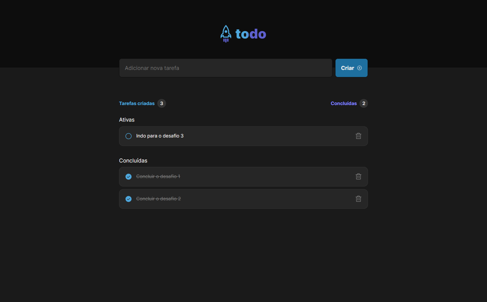
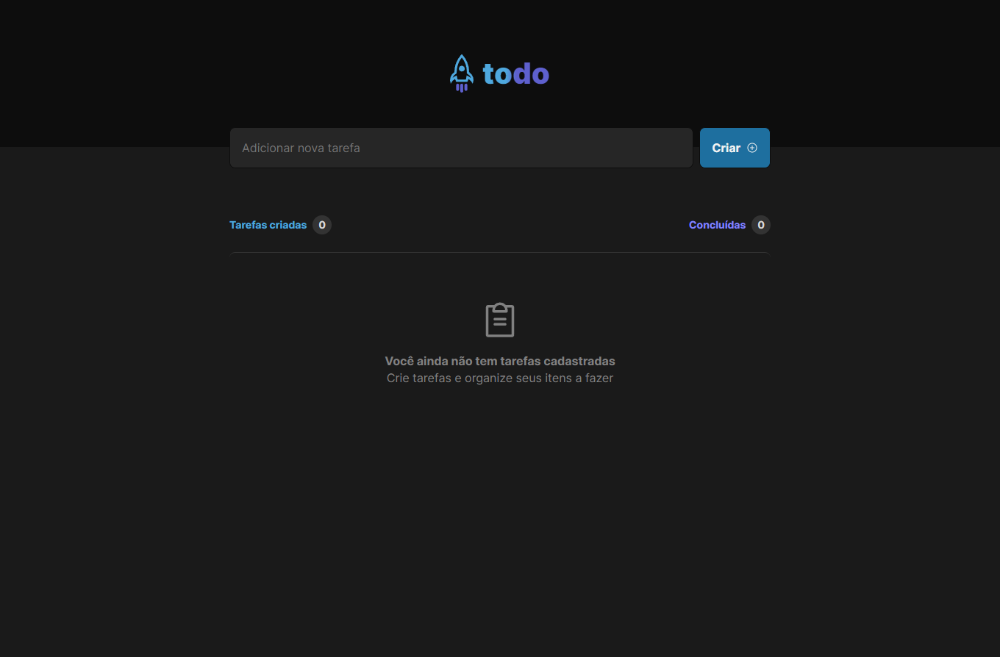

# README - Aplicação Todo List

## Visão Geral

A aplicação Todo List é uma aplicação simples em React com TypeScript que permite criar e gerenciar uma lista de tarefas. Ela não usa nenhum banco de dados, sendo que os dados são salvos no local storage do navegador.

Para estilização, foi utilizado o CSS Modules, assim cada componente possui um escopo único para as classes CSS utilizadas, garantindo que essas classes não interfiram em outros componentes.

Esta aplicação faz parte de um desafio do primeiro módulo do bootcamp.

## Recursos

A aplicação Todo List inclui os seguintes recursos:

- Adição de tarefas à lista
- Remoção de tarefas da lista
- Edição de tarefas existentes
- Marcação de tarefas como concluídas

## Instalação

Para executar a aplicação Todo List localmente, siga estas etapas:

1. Clone o repositório: `git clone https://github.com/felpfsf/todo-list.git`
2. Acesse o diretório do projeto: `cd todo-list`
3. Instale as dependências: `yarn`
4. Inicie a aplicação: `yarn dev`

## Uso

Para usar a aplicação Todo List, abra seu navegador e navegue até `http://localhost:5173`. Você verá a página inicial, onde poderá criar novas tarefas e gerenciar as tarefas existentes. Para editar uma tarefa, clique no botão "Editar" e faça as alterações necessárias. Para marcar uma tarefa como concluída, clique no botão de seleção à esquerda do texto da tarefa. Para remover uma tarefa, clique no botão "Excluir".

## Demonstração

### Functionalidade

### Telas

## Contribuindo

Se você quiser contribuir para a aplicação Todo List, sinta-se à vontade para enviar uma solicitação de pull request. Antes de enviar uma solicitação de pull request, certifique-se de que seu código segue as diretrizes de estilo de codificação e de que todos os testes passam.

## Licença

A aplicação Todo List é liberada sob a Licença MIT. Consulte o arquivo [LICENSE](LICENSE) para mais detalhes.
